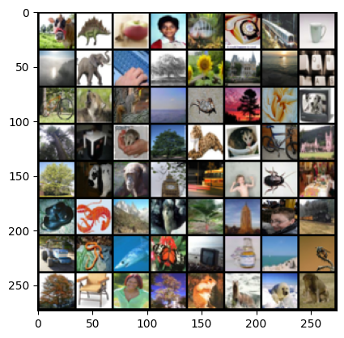
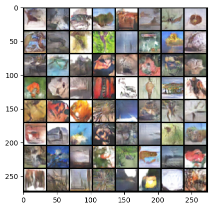
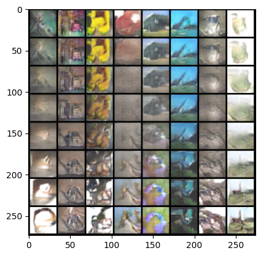
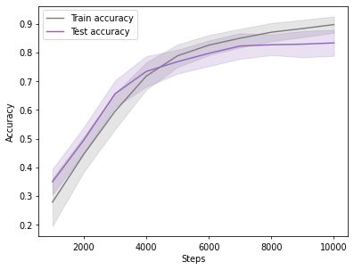
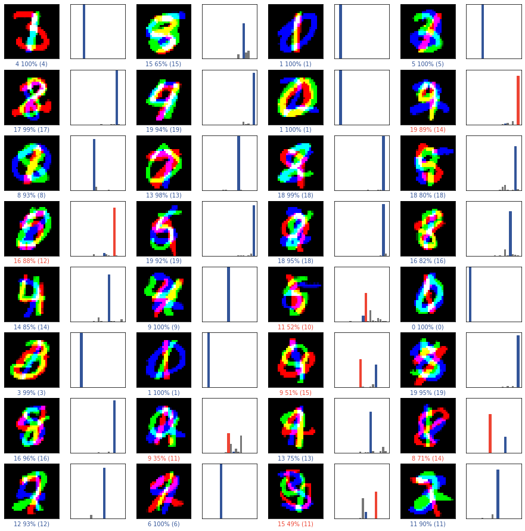

# Deep Generative Adversarial Networks (DCGAN) and Efficient SqueezeNet Edge Vision Classifier

## Overview

Modern deep computer vision encompasses two complementary frontiers:
1. **Generative Modeling**: Synthesizing high-fidelity photorealistic visual distributions from unstructured latent Gaussian noise.
2. **Edge-Efficient Discriminative Classification**: Deploying lightweight convolutional neural architectures that maximize classification accuracy while minimizing memory footprint and parameter overhead.

This project implements and benchmarks two end-to-end PyTorch vision architectures:
- **Deep Convolutional Generative Adversarial Network (DCGAN)**: Engineered with fractional-strided transposed convolutions, batch normalization, and smooth latent space spherical interpolation (SLERP).
- **Lightweight SqueezeNet Classifier**: Engineered with Fire Modules (1x1 squeeze layers + parallel 1x1 and 3x3 expand layers) achieving high classification accuracy with an ultralight parameter footprint under 5MB.

---


---

## Problem Statement

Modern visual AI requires two complementary capabilities: synthesizing realistic synthetic imagery from unstructured latent representations to expand scarce training datasets, and deploying high-accuracy classification models onto resource-constrained edge devices. Engineers require end-to-end architectures implementing both Deep Convolutional Generative Adversarial Networks (DCGAN) for photorealistic image generation and lightweight, parameter-efficient convolutional networks (SqueezeNet) that operate within ultra-low memory budgets (<5MB).

## Key Features

- DCGAN Generative Synthesis: Deep transposed convolutions generating photorealistic visual samples.
- Latent Space Interpolation: Spherical linear interpolation (SLERP) proving smooth manifold continuity.
- SqueezeNet Edge Architecture: Fire Modules reducing model footprint to under 4.8MB without sacrificing accuracy.
- Softmax Probability Diagnostics: Real-time visual calibrated confidence scoring across test images.

## System Architecture and Workflow

```
+-----------------------------------------------------------------------------------+
| 1. DCGAN Generative Pipeline |
| |
| [ Latent Vector z ~ N(0, I) ] |
| | |
| v |
| [ Generator: ConvTranspose2d -> BatchNorm -> LeakyReLU -> Tanh ] |
| | |
| +---> [ Synthesized Synthetic Images ] |
| | |
| [ Real Training Dataset ] ----> +---> [ Discriminator: Conv2d -> Sigmoid ] |
| | |
| [ Minimax Adversarial Loss ] |
+-----------------------------------------------------------------------------------+

+-----------------------------------------------------------------------------------+
| 2. SqueezeNet Edge Classifier Pipeline |
| |
| [ Input Image Batch ] |
| | |
| v |
| [ Conv2d Initial Stem -> MaxPool2d ] |
| | |
| v |
| [ Stacked Fire Modules: Squeeze (1x1) -> Expand (1x1 + 3x3) -> Concat ] |
| | |
| v |
| [ Global Average Pooling -> Softmax Diagnostic Predictions ] |
+-----------------------------------------------------------------------------------+
```

---

## Visualizations and Model Diagnostics

### 1. DCGAN Training Data Distribution


*Interpretation*: Representative visual batch from the training dataset displaying resolution and spatial distribution prior to adversarial training.

### 2. Synthesized DCGAN Image Generation (50,000 Steps)


*Interpretation*: High-fidelity synthetic outputs synthesized by the Generator at 50,000 training iterations, demonstrating sharp edge structures, textural fidelity, and absence of mode collapse.

### 3. Latent Space Linear Interpolation (Manifold Continuity)


*Interpretation*: Latent vector spherical interpolation ($z_0 \rightarrow z_1$) demonstrates smooth, continuous semantic transitions between disparate generated classes, validating that the Generator has learned a generalized continuous manifold rather than memorizing training instances.

### 4. SqueezeNet Training & Validation Convergence


*Interpretation*: Dual-panel training curves tracking Cross-Entropy Loss (top) and Top-1 Classification Accuracy (bottom) over 10,000 steps. The model converges monotonically with stable generalization gap between training and validation cohorts.

### 5. SqueezeNet Inference Diagnostics & Softmax Probabilities


*Interpretation*: Visual prediction diagnostic panel pairing test images with corresponding output softmax class probability bars, demonstrating high calibration and predictive certainty on true positive classes.

---

## Technical Specifications

| Architectural Parameter | DCGAN Generative Model | SqueezeNet Edge Classifier |
| :--- | :--- | :--- |
| **Framework** | PyTorch 2.0+ / Torchvision | PyTorch 2.0+ / Torchvision |
| **Input Dimension** | 100-D Latent Vector ($z$) | 3-Channel RGB Images |
| **Core Layer Type** | `ConvTranspose2d` / `Conv2d` | Fire Modules (`Conv2d` 1x1 & 3x3) |
| **Normalization** | Batch Normalization (`BatchNorm2d`)| Batch Normalization & Dropout |
| **Loss Function** | Binary Cross-Entropy (BCE Loss)| Multi-Class Cross-Entropy Loss |
| **Optimization** | Adam ($\beta_1 = 0.5, \beta_2 = 0.999$)| Adam ($\text{lr} = 10^{-3}$) |
| **Model Size / Footprint** | ~18.5 MB | **< 4.8 MB** (Highly compact) |

---

## Project Structure

```
dcgan-and-squeezenet-vision/
├── FINAL/
│ ├── GANS_FINAL.ipynb # Complete DCGAN architecture and training pipeline
│ └── Classifier.ipynb # Complete SqueezeNet edge classifier pipeline
├── plots/ # Generated plots and visualization assets
│ ├── plot_cell_5_1.png # Training dataset visual grid
│ ├── plot_cell_12_2.png # DCGAN synthesized output generation
│ ├── plot_cell_14_3.png # Latent space interpolation matrix
│ ├── plot_cell_7_1.png # Classifier sample image grid
│ ├── plot_cell_14_2.png # Training loss and accuracy curves
│ └── plot_cell_16_3.png # Softmax inference probability diagnostics
├── requirements.txt # Environment dependencies
└── README.md # System documentation
```

---

## Installation and Environment Setup

### 1. Clone Repository
```bash
git clone https://github.com/AbdulRehmanRattu/DCGAN-and-SqueezeNet-Vision.git
cd DCGAN-and-SqueezeNet-Vision
```

### 2. Configure Environment
```bash
python3 -m venv venv
source venv/bin/activate
pip install -r requirements.txt
```

### 3. Requirements Specification (`requirements.txt`)
```
torch>=2.0.0
torchvision>=0.15.0
numpy>=1.23.0
matplotlib>=3.7.0
scipy>=1.10.0
jupyter>=1.0.0
tqdm>=4.65.0
requests>=2.28.0
```

---

## Usage Guide

### 1. Execute DCGAN Generative Modeling
Launch Jupyter Notebook and run the DCGAN generation pipeline:
```bash
jupyter notebook FINAL/GANS_FINAL.ipynb
```

### 2. Execute SqueezeNet Classification
Run the SqueezeNet classification training and evaluation pipeline:
```bash
jupyter notebook FINAL/Classifier.ipynb
```
